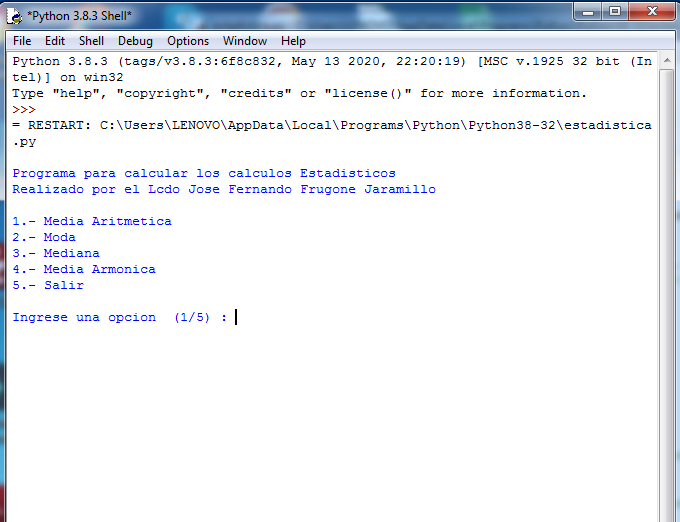

# Estadistica_python
Repositorio donde muestra las funciones Estadisticas en Python

  

Mediante este repositorio se va a explicar el uso de funciones definidas por el usuario y las funciones estadísticas que podemos usar en Python, que  en donde primeramente Python lo podemos descargar para instalar en la computadora desde el siguiente link o enlace:
https://www.python.org/

Para poder hablar de las funciones hablamos de la Ultima  version de Python 3.8.0 link o enlace de la ultima documentacion de Python esta en:

https://docs.python.org/3/tutorial/index.html

Para hablar de las funciones tenemos el siguiente link o enlace:

https://docs.python.org/3/tutorial/controlflow.html#defining-functions

En el presente programa calculamos  la media aritmetica,  la moda, la mediana,  y la media armonica

  

Codigo para Media

import statistics as stats
import math
# Para el calculo de la media
def media(numero):
    # Para calcular la media aritmetica
    # definimos los numeros que valor a
    # ingresar dependiendo del total
    # de numeros a ingresar
    # Variable valor para los valores a ingresar
    # Variable cont para contar
    # hasta el numero de veces a ingresar
    valor = 0
    cont = 0
    # Definimos el tamaño del arreglo
    datos = []
    # para el tamaño
    for cont in range(0,numero): 
        # Para los numeros que se va a ingresar
        # dependiendo de los numeros
        valor = int(input(f"Ingrese valor del indica {cont} : ".format(cont)))
        datos.append(valor)
    # Para mostrar la media aritmetica de los numeros ingresados
    print()
    print("La media es : ", round(sum(datos)*1.0 / numero,2))
# Termino de la funcion de la Media aritmetica

Para la moda tenemos la funcion moda
# Para el calculo de la moda
def moda(numero):
    # Para el calculo de la moda es el valor que se repite
    cont = 0
    valor = 0
    # definimos el tamaño del arreglo
    datos = []
    # para el total de valores
    for cont in range(0,numero):
        valor = int(input(f"Ingrese valor de la posicion {cont} de este numero : ".format(cont)))
        
        datos.append(valor)
    # Para mostrar la moda
    # de un conjunto de numeros
    print()
    print("La moda es : ", stats.mode(datos), end="")
    p
   
   Para la mediana en Estadistica tenemos
   
   # Para el calculo de la mediana
def mediana(numero):
    # Para el calculo de la mediana encuentra el valor central
    # de un grupo de valores
    cont = 0
    valor = 0
    # Definimos el tamaño del arreglo
    datos = []
    # para el tamaño del arreglo
    for cont in range(0,numero):
        # Para la mediana
        valor = int(input(f"Ingrese valor de la posicion {cont} de este numero : ".format(cont)))
        datos.append(valor)
    # Para mostrar la mediana
    print()
    print("La mediana es : " , stats.median(datos))
    
    # Para la media armonica tenemos
    
 def media_arm(numero):
    # Para el calculo de la media armonica es el reciproco
    # de la media aritmetica de los inversos de los datos
    cont = 0
    valor = 0
    # Definimos el arreglo
    datos = []
    # para recorrer el arreglo
    for cont in range(0,numero):
        # Para la Media Armonica
        valor = int(input(f"Ingrese valor de posicion {cont} de este numero : ".format(cont)))
        datos.append(valor)
    # Para mostrar la Media Armonica
    print()
    print("La media Armonica es : " , stats.harmonic_mean(datos))   
